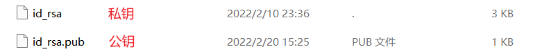

# 4 SSH密钥


SSH密钥是SSH协议中使用的访问凭据，类似于密码。SSH密钥授予用户自动远程访问企业的核心设备的权限。


### 4.1 主机密钥 Host Key

> 每个主机（即计算机）都有**唯一的**主机密钥。

* 在Linux中存储在`/etc/sshssh_host_<rsa/dsa/ecdsa/ed25519>_key`
* 在Windows中存储在`C:\ProgramData\ssh`

当你首次通过SSH连接一台远程主机时，通常会得到这样的提示：

```powershell
❯❯❯ ssh user@ip-address
The authenticity of host 'ip-address (ip-address)' can't be established.
ECDSA key fingerprint is SHA256:hjn60Ix3hjduyfhjHLJKOdJSDDX6beXpfp0ypeqTOPQ+f0tU.
Are you sure you want to continue connecting (yes/no/[fingerprint])?
```

当你输入`yes`并按下Enter继续之后，你就会看到这样提示：

```powershell
Warning: Permanently added 'ip-address' (ECDSA) to the list of known hosts.
user@ip-address's password:
```

它就会以这样的形式添加到**已知主机密钥列表**中

```
ip-address ecdsa-sha2-nistp256 AAAAE2VjZHNhLXNoYTItbmlzdHAyNTYAAAAIbmlzdHAyNTYAAABBBEvRRBRoCJSuJuEaXK3i3k/4Cd+uriN5cKPGbbl/Q5f5DhjduyfhjHLQXDZPVDw0reLJKmIcGcZh2qQHX5qjMLQ=
```

> **已知主机密钥列表**:SSH客户端用来存储曾经连接到的主机的主机密钥
>
> * 在Linux中存储在\`/etc/ssh/known\_hosts.ssh/known\_hosts
> * 在Windows中存储在`C:\Users\User\.ssh\known_host`

### 4.2 授权密钥 Authorized Key

SSH中的授权密钥是用于授予用户登录访问权限的[公钥](4-ssh-mi-yue.md#4.5.1-gong-yao-public-key)。身份验证机制称为公钥身份验证。在OpenSSH中可以使用`ssh-keygen`工具生成，通常会生成一对密钥（私钥-公钥），如下图所示。

<figure><figcaption></figcaption></figure>

#### 4.2.1 用于服务器端的authorized\_keys文件

在authorized\_keys文件为每个用户单独配置授权密钥。

* 在Linux中存储在`~/.ssh/authorized_keys`
* 在windows中存储在`C:\Users\user\.ssh\authorized_keys`

你可以再SSH服务器的配置文件中修改它的保存路径

授权密钥内容如下所示：

```
ecdsa-sha2-nistp256 AAAAE2VjZHNhLXNoYTItbmlzdHAyNTYAAAAIbmlzdHAyNTYAAABBBN+Mh3U/3We4VYtV1QmWUFIzFLTUeegl1Ao5/QGtCRGAZn8bxX9KlCrrWISIjSYAwCajIEGSPEZwPNMBoK8XD8Q= user@host-name
```

### 4.3 标识密钥Identity Key&#x20;

标识密钥是一种[私钥](4-ssh-mi-yue.md#4.5.2-si-yao-private-key-idprikey)，在SSH公钥身份验证中用于授予访问服务器的权限。在OpenSSH中可以使用`ssh-keygen`工具生成，通常会生成一对密钥（私钥-公钥），如下图所示。

<figure><figcaption></figcaption></figure>

### 4.4 会话密钥 Session Key

SSH协议利用Key Exchange算法为每个会话或连接派生一个唯一的密钥，这个密钥被称为会话密钥（Session Key），常见的Key Exchange算法有[Diffie-Hellman](https://zh.wikipedia.org/wiki/%E8%BF%AA%E8%8F%B2-%E8%B5%AB%E7%88%BE%E6%9B%BC%E5%AF%86%E9%91%B0%E4%BA%A4%E6%8F%9B) 和[Elliptic-curve Diffie–Hellman](https://zh.wikipedia.org/wiki/%E6%A9%A2%E5%9C%93%E6%9B%B2%E7%B7%9A%E8%BF%AA%E8%8F%B2-%E8%B5%AB%E7%88%BE%E6%9B%BC%E9%87%91%E9%91%B0%E4%BA%A4%E6%8F%9B)。

会话密钥在会话连接双方之间共享，这很容易受到中间人攻击。

向前保密性：由于使用了会话密钥，即使长期密钥（[主机密钥](4-ssh-mi-yue.md#4.1-zhu-ji-mi-yao-host-key-idhostkey)）泄露，入侵者也无法解密之前的会话内容。

### 4.5 关于密钥的基础知识

#### 4.5.1 公钥Public Key

公钥是与私钥算法一起使用的密钥对的非秘密一半。公钥通常用于**加密会话密钥**、**验证数字签名**，或加密可以用相应的私钥解密的数据。公钥和私钥是通过一种算法得到的一个密钥对(即一个公钥和一个私钥)，其中的一个向外界公开，称为公钥；另个自己保留，称为私钥。通过这种算法得到的密钥对能保证在世界范围内是唯一的。使用这个密钥对的时候,如果用其中一个密钥加密一段数据，必须用另一个密钥解密。如用公钥加密数据就必须用私钥解密，如果用私钥加密也必须用公钥解密，否则解密将不会成功。

在SSH中，公钥加密用于对计算机和用户进行身份验证。[主机密钥](4-ssh-mi-yue.md#4.1-zhu-ji-mi-yao-host-key)对主机进行身份验证。[授权密钥](4-ssh-mi-yue.md#4.2-shou-quan-mi-yao-authorized-key)和身份密钥对用户进行身份验证。

#### 4.5.2 私钥Private Key

在公钥密码系统中，私钥是用于对文档进行数字签名的密钥。在某些密码系统中，它还可用于解密使用公钥加密的数据。每个私钥都有一个对应的公钥。通常，公钥可以很容易地从私钥派生，但从公钥派生私钥在计算上是不可行的。

在SSH中，私钥用于对计算机和用户进行身份验证。[主机密钥](4-ssh-mi-yue.md#4.1-zhu-ji-mi-yao-host-key)对服务器进行身份验证，[标识密钥](4-ssh-mi-yue.md#4.3-biao-shi-mi-yao-identity-key)用作用户的身份验证凭据。
