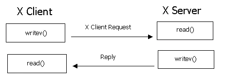

# 7 常见问题

### 7.1 SSH中的中间人攻击

黑客和恶意软件会攻击路由器、DSL解调制器和WiFi路由器，在上面安装恶意软件来执行中间人攻击，安装了恶意软件的设备被称为**攻击工具**。

在SSH协议中，主机密钥只能由root用户访问。如果攻击者获得了服务器的root访问权限，他当然可以获得主机密钥的副本。

一旦攻击者获取到服务器主机密钥的副本，当客户端连接时，就可以在攻击工具上，冒充SSH服务端与客户端建立连接，骗取服务器端的密码或密钥。

然后再攻击工具上充当客户端，与服务器建立另一个加密连接。

### 7.2 X11转发 X11-Forwarding

#### 7.2.1 什么是X11-forwarding？

X11中的X指的就是X协议；11指的是采用X协议的第11个版本。 X11-forwarding说的简单明白点就是：可以通过一个支持X Server的SSH客户端，例如：MobaXterm。 连接到远程Linux服务器，可以在本地通过MobaXterm运行操作一个远程Linux服务器上有图形界面的程序。

#### 7.2.2 X协议原理简介

<figure><figcaption></figcaption></figure>

Linux系统本身是没有图形化界面的，所谓的图形化界面系统只不过中Linux下的应用程序，所有的Linux系统的图形化界面应用程序底层都是基于X协议。

X协议由X server和X client组成：

* server管理主机上与显示相关的硬件设置（如显卡、硬盘、鼠标等），它负责屏幕画面的绘制与显示，以及将输入设置（如键盘、鼠标）的动作告知X client。
* X client (即 X 应用程序) 则主要负责事件的处理（即程序的逻辑）。

举个例子，如果用户点击了鼠标左键，因为鼠标归X server管理，于是X server就捕捉到了鼠标点击这个动作，然后它将这个动作告诉X client，因为X client负责程序逻辑，于是X client就根据程序预先设定的逻辑（例如画一个圆），告诉X server说：“请在鼠标点击的位置，画一个圆”。最后，X server就响应X client的请求，在鼠标点击的位置，绘制并显示出一个圆。

#### 7.2.3 支持X11-forwarding的SSH客户端

* XShel- 6
* MobaXterm 11

### 7.3 SCP和SFTP相同点和区别

都是使用SSH协议来传输文件的。登录时的用户信息都是经过SSH加密后才传输的，所以说SCP和SFTP实现了安全的文件传输。 SCP和SCP命令相似，SFTP和FTP的使用方法也类似。SCP和SFTP的共同之处在于（**使用SSH将文件加密才传输的**）

SCP和SFTP的不同之处：

* SCP比较简单，是轻量级的，SFTP的功能则比较多。
* SFTP在文件传输过程中中断的话，连接后还可以继续传输，但SCP不行。

### 7.4 Windows配置自动登录的问题

以Windows作为服务端并按照6.5 实现SSH免密码登录（公钥身份认证）中的步骤配置时，在连接时依然要求输入密码。

我尝试重启了服务端的`OpenSSH SSH Server`服务，依然没有效果。

使用`ssh -vvv`查看调试信息

```log
debug3: send packet: type 50
debug2: we sent a keyboard-interactive packet, wait for reply
debug3: receive packet: type 51 
debug1: Authentications that can continue: publickey,password,keyboard-interactive
```

这是以Ubuntu为服务器端自动登录成功的调试信息

```log
debug3: sign_and_send_pubkey: signing using rsa-sha2-512
debug3: send packet: type 50
debug3: receive packet: type 52
debug1: Authentication succeeded (publickey).
Authenticated to 10.0.0.20 ([10.0.0.20]:2000).
```

可以看出在以Windows为服务器端时，客户端发送了密钥，但是服务器端并没有回应。

可以通过阿里云盘获取完整的调试信息

### SSH隧道

SSH隧道即SSH端口转发，在SSH客户端与SSH服务端之间建立一个隧道，将网络数据通过该隧道转发至指定端口，从而进行网络通信。SSH隧道自动提供了相应的加密及解密服务，保证了数据传输的安全性。

SSH隧道有三种端口转发模式：本地端口转发（Local Port Forwarding）、远程端口转发（Remote Port Forwarding）以及动态端口转发（Dynamic Port Forwarding）。对于本地/远程端口转发，两者的方向恰好相反。连接云手机时，使用的是本地端口转发，因此本文着重介绍本地端口转发的工作原理。

假设本地主机A1为SSH客户端，远端云主机B1为SSH服务端。从A1主机通过SSH登录B1主机，指定不同的端口转发选项（-L、-R和-D），即可在A1与B1之间建立SSH隧道，从而进行不同的端口转发。

应用场景

远端云主机B1上运行了一个服务，端口为2000，本地主机A1需要访问这个服务。假设云主机B1的IP为122.x.x.x，则该服务的访问地址为：http://122.x.x.x:2000

为什么需要本地端口转发？

一般来讲，云主机的防火墙默认只开启了22端口，如果需要访问2000端口，则需要修改防火墙。为了保证安全，防火墙需要配置允许访问的IP地址。但是，云主机的公网IP通常是网络提供商动态分配的，如果变更公网IP地址，防火墙配置就需要经常修改，造成不必要的麻烦。

什么是本地端口转发？

本地端口转发，是将发送到本地端口的请求，转发到目标端口，这样就可以通过访问本地端口，来访问目标端口的服务。使用-L选项，就可以指定需要转发的端口，语法如下：

ssh-L本地端口:目标地址:目标端口

例如：

```shell
ssh -L 3000:localhost:2000 root 122.x.x.x
```

表示在本地主机A1登录远端云主机B1，通过本地端口转发，将发送到本地主机A1端口3000的请求，转发到远端云主机B1的2000端口。

这样，在本地主机A1上可以通过访问http://122.x.x.x:2000来访问远端云主机B1上的服务。
